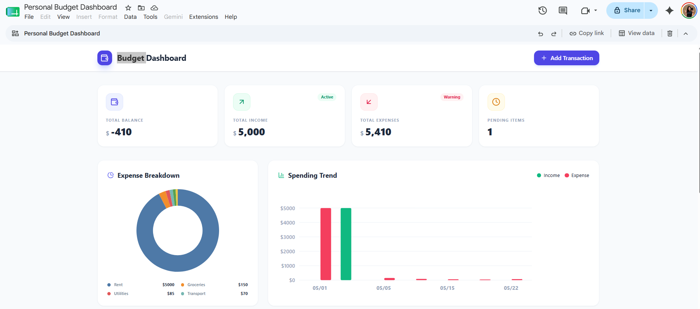

# Budget Tracking Dashboard in Google Sheets

A two-step workflow that uses Gemini inside Google Sheets to generate mock spending data and then turn it into an editable budget-tracking dashboard via the Canvas feature.

---

## Preview



---

## Step 1: Generate Mock Data

Open Gemini inside your Google Sheet and paste:

```text
Generate me the table that contain the daily spend and fill the table with the mock up data pls.
```

Gemini will populate a fresh table with realistic daily spending entries that you can use as the data source for the dashboard in Step 2.

---

## Step 2: Build the Editable Dashboard

With the mock data already in the sheet, open Gemini Canvas and paste:

```text
Create me the editable dashboard for keep tracking budget plan.
```

Gemini Canvas will read the daily spend data from Step 1 and construct an interactive budget dashboard you can edit directly inside the canvas.
