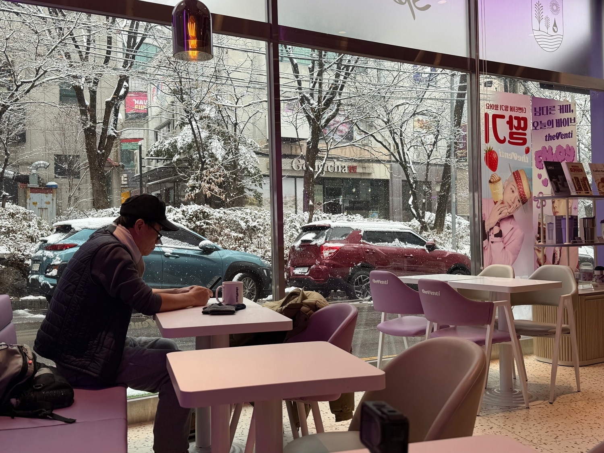
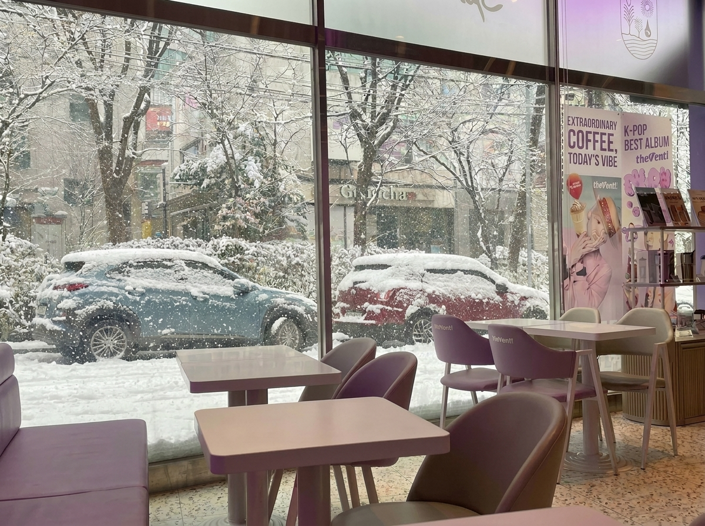
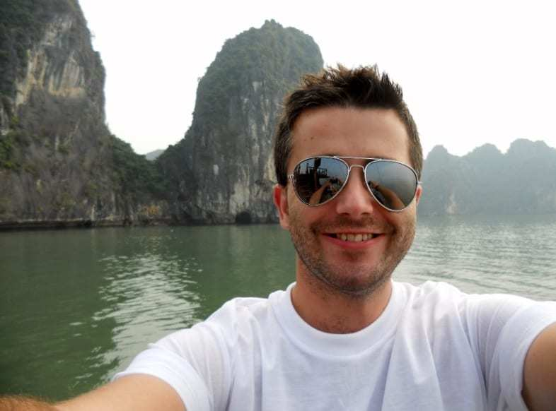
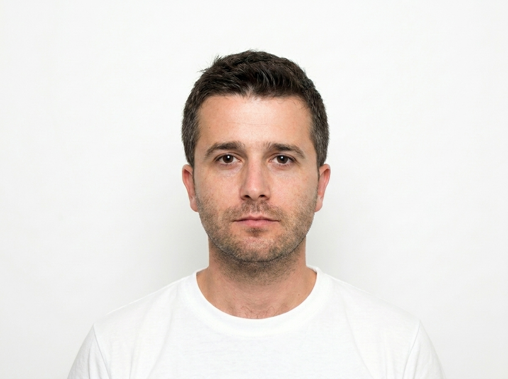

# Google Flow Image Editing: Use Cases 1 and 2

<p align="center">
  
  &nbsp;&nbsp;<span style="font-size: 48px; vertical-align: middle;">→</span>&nbsp;&nbsp;
  
</p>

**Basic removal:**

```
Remove the crowd of people in the background, keep the landmark and sky exactly the same.
```

**Specific person removal:**

```
Remove the person in the red jacket on the left side of the image, fill in the background naturally, keep everything else identical.
```

**Multiple object removal:**

```
Remove all the cars parked in front of the house, replace with clean asphalt that matches the existing driveway texture.
```

**Logo or text removal:**

```
Remove the logo from the front of the shirt, keep the fabric texture, folds, and color unchanged.
```

## Use Case 2: Change Background to Professional

<p align="center">
  
  &nbsp;&nbsp;<span style="font-size: 48px; vertical-align: middle;">→</span>&nbsp;&nbsp;
  
</p>

**Studio backdrop:**

```
Replace the background with a smooth light-gray studio backdrop, add a soft natural shadow under the subject, keep the person's face, hair, and clothing exactly the same.
```

**Solid color background for ID photos:**

```
Replace the background with a solid white background suitable for a passport photo, keep the subject centered and unchanged.
```

**Office environment:**

```
Replace the background with a softly blurred modern office interior, warm lighting, keep the subject in sharp focus with natural shadows.
```

**Branded color background:**

```
Replace the background with a solid deep navy blue color, keep the subject's face, clothing, and hair edges natural and unchanged.
```

**Gradient background:**

```
Replace the background with a smooth gradient from light gray at the top to medium gray at the bottom, professional headshot style.
```
