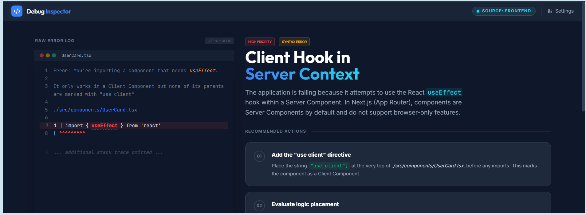

# Non-Linear Full-Stack Error Detective

A specialized full-stack debugging triage pipeline inside Google Opal. It analyzes raw stack traces, terminal crashes, or browser console errors to trace data lifecycles and pinpoint exactly where an application failed. https://opal.google/app/1ipy9l4vLZHvnnLGeFtMzYIvlE5wNOrBb

---

## Preview



---

## Prompt to Build

```text
Make a debugging tool where I paste a coding error or crash log, and it tells me if the bug is in my frontend or backend and gives me a quick checklist to fix it.
```

---

## System Architecture & Data Flow

The engine uses a sequential pipeline architecture consisting of three discrete node steps:

```
┌─────────────────────────┐
│ ErrorLogInput  (Yellow) │
└────────────┬────────────┘
             │  raw crash log
             ▼
┌─────────────────────────┐
│  Diagnostic Engine      │  (Blue)
└────────────┬────────────┘
             │  triage report
             ▼
┌─────────────────────────┐
│ DebugChecklist (Green)  │
└─────────────────────────┘
```

1. **User Input Node (Yellow):** Gathers raw runtime errors from the console, network tab, or server terminal.
2. **Diagnostic Engine Node (Blue):** Isolates the error signatures and traces the system state across the application architecture layers.
3. **Display Output Node (Green):** Displays a prioritized, clear step-by-step troubleshooting checklist.

---

## Example Test Inputs

Realistic error logs to paste into the `ErrorLogInput` field, grouped by stack.

### Next.js

**1. Hydration mismatch**

```text
Unhandled Runtime Error

Error: Hydration failed because the initial UI does not match what was rendered on the server.

Warning: Text content did not match.
Server: "Welcome Guest"
Client: "Welcome John"

at throwOnHydrationMismatch
at tryToClaimNextHydratableInstance
at updateHostComponent
at beginWork
```

**2. Server Component importing browser API**

```text
Error: window is not defined

src/app/dashboard/page.tsx (14:5)

 12 | export default async function Dashboard() {
 13 |
>14 |   const width = window.innerWidth
    |                 ^
 15 |
 16 |   return <div>{width}</div>
```

**3. Missing use client**

```text
Error: You're importing a component that needs useEffect.

It only works in a Client Component but none of its parents are marked with "use client"

./src/components/UserCard.tsx

1 | import { useEffect } from 'react'
  |          ^^^^^^^^^
```

**4. API route failed**

```text
GET /api/users 500 in 183ms

TypeError: Cannot read properties of undefined (reading 'email')

at GET (/app/api/users/route.ts:22:31)
at async executeRoute
```

**5. Environment variable missing**

```text
Error: Missing required environment variable

NEXT_PUBLIC_API_URL is undefined

at fetchData (/src/lib/api.ts:7:10)
at HomePage (/src/app/page.tsx:14:5)
```

**6. Module import failure**

```text
Failed to compile

./src/components/Header.tsx
Module not found: Can't resolve '@/lib/utils'

Import trace:
./src/app/layout.tsx
```

**7. Dynamic route parameter issue**

```text
TypeError: Cannot destructure property 'id' of 'params' as it is undefined

at ProductPage (/src/app/product/[id]/page.tsx:5:12)
```

---

### Spring Boot

**1. Port already in use**

```text
APPLICATION FAILED TO START

Description:

Web server failed to start. Port 8080 was already in use.

Action:

Identify and stop the process that's listening on port 8080 or configure another port.
```

**2. Bean creation failure**

```text
org.springframework.beans.factory.BeanCreationException:
Error creating bean with name 'userService'

Caused by:
org.springframework.beans.factory.NoSuchBeanDefinitionException:
No qualifying bean of type 'com.example.repository.UserRepository'
```

**3. Database connection failed**

```text
org.springframework.jdbc.CannotGetJdbcConnectionException:

Failed to obtain JDBC Connection

Caused by:
org.postgresql.util.PSQLException:

Connection to localhost:5432 refused
```

**4. Circular dependency**

```text
The dependencies of some of the beans in the application context form a cycle:

userController
↓
userService
↓
authService
↓
userController
```

**5. JSON parsing issue**

```text
Resolved [org.springframework.http.converter.HttpMessageNotReadableException:

JSON parse error:
Cannot deserialize value of type 'java.lang.Integer'
from String "abc"]
```

**6. Null pointer in controller**

```text
java.lang.NullPointerException:

Cannot invoke "User.getName()" because "user" is null

at com.example.controller.UserController.getUser(UserController.java:45)
```

**7. JWT authentication failure**

```text
io.jsonwebtoken.ExpiredJwtException:

JWT expired at 2026-05-22T09:35:10Z

Current time: 2026-05-22T11:15:22Z
```

---

### PostgreSQL

**1. Authentication failure**

```text
psql: error:

connection to server at "localhost" (::1), port 5432 failed:

FATAL: password authentication failed for user "postgres"
```

**2. Database does not exist**

```text
org.postgresql.util.PSQLException:

FATAL: database "production_db" does not exist
```

**3. Table does not exist**

```text
ERROR: relation "users" does not exist

LINE 1:
SELECT * FROM users;
```

**4. Duplicate key violation**

```text
ERROR: duplicate key value violates unique constraint "users_email_key"

Detail:
Key (email)=(john@example.com) already exists.
```

**5. Foreign key constraint failure**

```text
ERROR: insert or update on table "orders"
violates foreign key constraint "orders_user_id_fkey"

Detail:
Key (user_id)=(999) is not present in table "users"
```

**6. Connection limit reached**

```text
FATAL:

remaining connection slots are reserved for non-replication superuser connections
```

**7. Syntax error**

```text
ERROR: syntax error at or near "WHERE"

LINE 1:
SELECT FROM users WHERE id=1;
```

**8. Deadlock detected**

```text
ERROR: deadlock detected

DETAIL:
Process 18233 waits for ShareLock on transaction 92381;
blocked by process 18240.
```

**9. Out of disk space**

```text
ERROR:

could not extend file "base/16384/2619":

No space left on device
```
