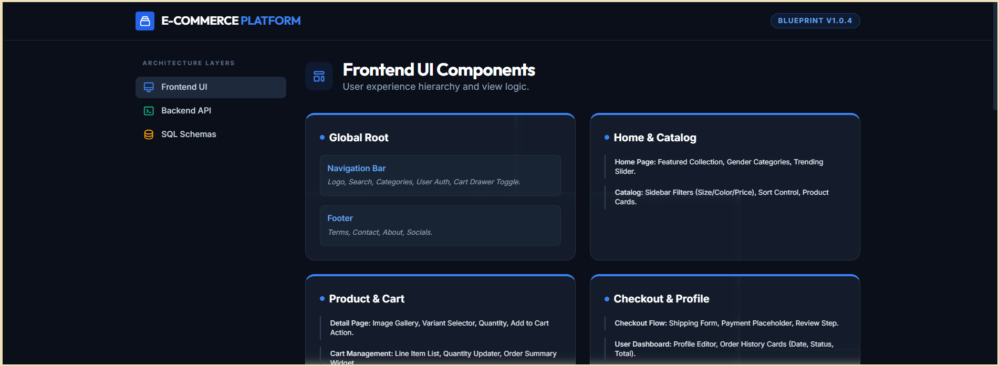

# Feature-to-Database Planner

An automated, node-based development utility built inside Google Opal. This tool accepts plain-language app feature descriptions and transforms them through an AI architecture pipeline into a structured full-stack blueprint covering Frontend UI components, Backend API routes, and Database schema tables.

---

## Preview



---

## Prompt to Build

```text
Build an app where I can type in my website features, and it splits them into frontend UI parts, backend API endpoints, and SQL database tables.
```

---

## System Architecture & Data Flow

The engine uses a sequential pipeline architecture consisting of three discrete node steps:

```
┌─────────────────────────┐
│  Feature Input (Yellow) │
└────────────┬────────────┘
             │  feature description
             ▼
┌─────────────────────────┐
│  Architecture Mapper    │  (Blue)
└────────────┬────────────┘
             │  3-section blueprint
             ▼
┌─────────────────────────┐
│  Multi-Column View      │  (Green)
└─────────────────────────┘
```

1. **User Input Node (Yellow):** Receives a descriptive list of features you want to build for your application.
2. **Architecture Mapper Node (Blue):** Acts as a senior systems architect, breaking the user's concept into structured, decoupled full-stack architectural layers.
3. **Display Output Node (Green):** Streams the multi-layered markdown plan directly to your workspace dashboard view.

---

## Example Test Inputs

Sample prompts to paste into the `FeatureInput` field.

### Realistic single prompt

A real user normally sends one comprehensive prompt covering multiple features at once:

```text
I sell clothes and want a website where customers can view products, create accounts, add items to a cart, pay online, track orders, and receive notifications after purchase.
```

### Component-focused examples

Narrower prompts to test how the tool handles smaller scopes.

**1. General online store** (core shopping flow)

```text
I want to create a website for my shop where customers can see products, search products, add them to cart, and buy online.
```

**2. Clothing store** (specific business type with user accounts)

```text
I sell clothes and want a simple website where users can create accounts and order products.
```

**3. E-commerce operations** (shopping features plus post-purchase process)

```text
I need an online store website with product images, prices, payment, and order tracking.
```

**4. Notifications** (one specific requirement)

```text
I want customers to receive notifications after purchasing something.
```
