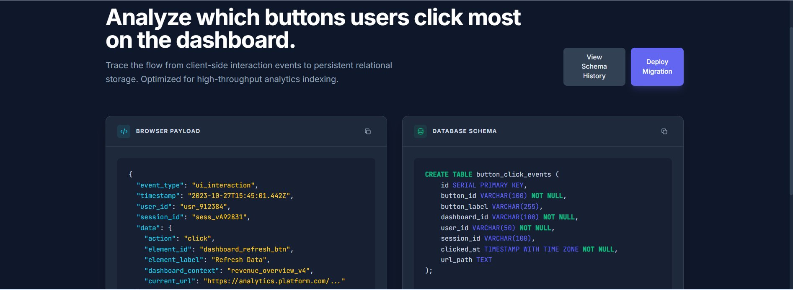

# API Payload Structure Visualizer

A visual data architecture modeling tool inside Google Opal. This pipeline allows full-stack developers to track exactly how data changes shape as it travels over the wire from client submission to server validation and persistence.

---

## Preview



---

## Prompt to Build

```text
Create a tool that lets me describe a user action, like signing up, and shows me the exact JSON payload the browser sends versus what the database row looks like.
```

---

## System Architecture & Data Flow

The engine uses a sequential pipeline architecture consisting of three discrete node steps:

```
┌─────────────────────────┐
│  ActionDescription      │  (Yellow)
└────────────┬────────────┘
             │  user intent
             ▼
┌─────────────────────────┐
│  Payload Generator      │  (Blue)
└────────────┬────────────┘
             │  3-state payload map
             ▼
┌─────────────────────────┐
│  Side-by-Side View      │  (Green)
└─────────────────────────┘
```

1. **User Input Node (Yellow):** Accepts a standard high-level business logic action description.
2. **Payload Generator Node (Blue):** Models data structures at every lifecycle checkpoint of a full-stack transaction.
3. **Display Output Node (Green):** Organizes the three structural state representations side-by-side in clear code blocks.

---

## Example Test Inputs

Sample prompts to paste into the `ActionDescription` field.

### Realistic single prompt

A natural-language prompt a real user would type:

```text
I want to understand how my form data moves from the frontend to the backend and database, and where the data structure changes along the way.
```

```text
Analyze how the signup form data changes from the React client to the Spring Boot backend and finally into PostgreSQL.
```

```text
Trace the product creation request from Next.js form submission to API validation, DTO mapping, database insert, and response payload.
```

```text
Show me how the user registration data is transformed before it is saved in the database.
```

```text
Analyze the data flow for a checkout request, including client payload, server validation, payment status update, and order persistence.
```

```text
Map how the frontend form fields match the backend DTO fields and PostgreSQL table columns.
```

```text
Find where the request payload changes shape between the client, API route, service layer, and database schema.
```

```text
Analyze this full-stack data pipeline and show where type mismatches or missing fields may happen.
```

```text
Visualize how a submitted form becomes a validated backend object and then a database row.
```

```text
Compare the frontend TypeScript interface, backend request DTO, and PostgreSQL table schema for inconsistencies.
```

```text
Trace the API response from PostgreSQL query result to backend response object and frontend UI state.
```
